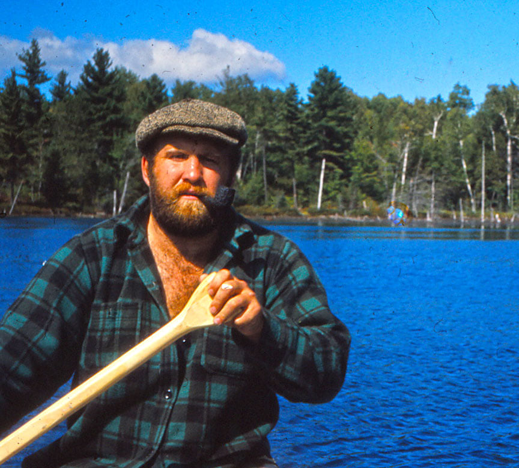
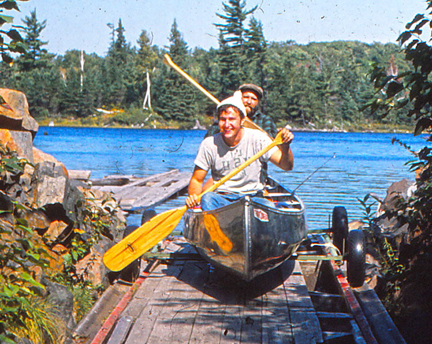
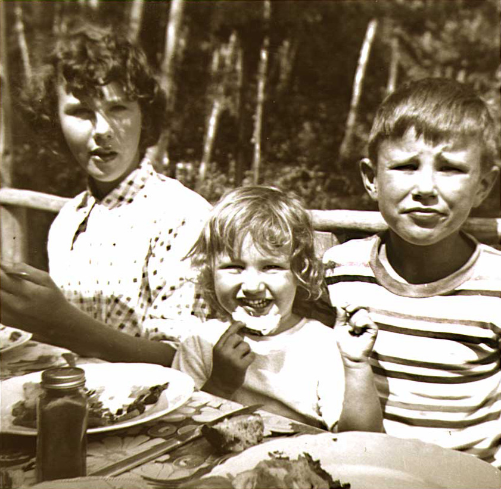
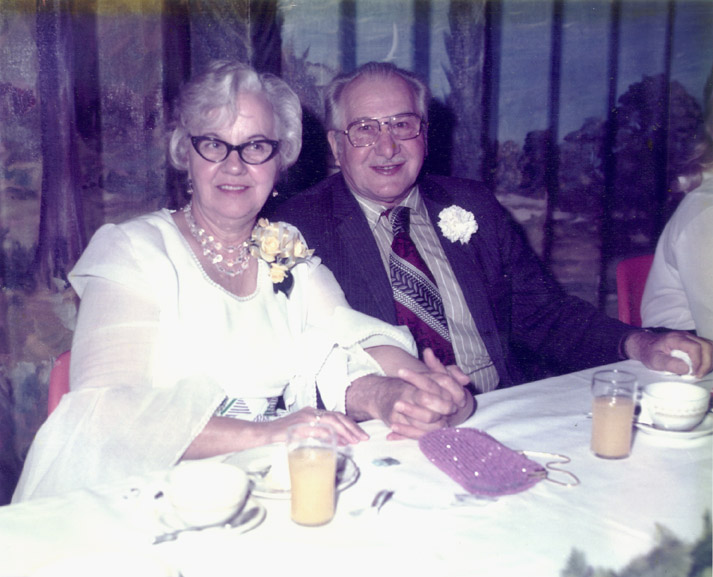
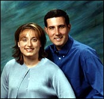
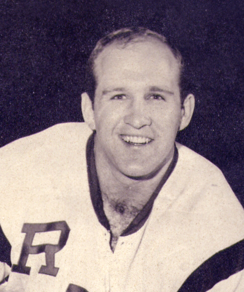
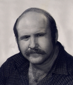

# Maksymowicz - Macks

Parents of Eugene, Paul, Rhodie and Helen.

Eugene Macks migrated from Canada to Detroit and sired Gene, Vivian, Jonathan and Robert.  

Rhodie married Anne. Their kids: [Dennis Macks](https://lougheedfuneralhomes.com/book-of-memories/2019988/macks-dennis/obituary.php) and Sonya (Macks) Matichuk.

 
Rob writes. my cousin Dennis was someone I looked up to as a model outdoorsman. We did a trip together, in my brand new aluminum canoe, about 1971, starting at the cabin at Panache and portaging into the many lakes of Killarney Provincial Park to the south, before anyone knew it existed. He shattered my image of him as a great outdoorsman after he built a campfire in the base of a tree and later that night we woke up to the tree burning. Luckily it was close to the lake and we jumped in and splashed the tree until the fire was out.  
 

Our family name was Maksymowicz before grandma changed it to Macks to deal with discrimination and pronunciation. Our cousin says the "Mak or Mac" part of our name indicates Viking origin. They were everywhere. My understanding is that the "son of" ending of the name is "vitch" in Russian, "wicz" Ukrainian, and "witz" Jewish. All pronounced like vitch.  
SON OF A VITCH!
&ndash; From Rob Macks, [Laughing Loon](https://laughingloon.com)  

Jon Mack's DNA test found more DNA from the local area (87% Eastern Europeans) than the average Russian/Polish person's, which is 59% Eastern European. So we're original gangstas - yet he has only 1.1% Neanderthal. 

Jon is also 6% Finland/Siberia, 4% Jewish Diaspora, and 3% Central Asia. In contrast, the average polish person is 5% Finland/Siberia, 6% Jewish Diaspora, and 3% Central Asia, plus the average Polish person has four other ancestries my uncle didn't have: 13% Western/Central European (Germanic), 7% Southern European and 5% Asia Minor (both incoming agricultural migrations), and 2% Scandinavian. So did we live deep in the hills and forests of Eastern Europe (Ukrainian and Poland), away from the wandering influxes?  

When the family migrated to Sudbury in Ontario, Canada, they sold supplies to lumberjacks by hiking into remote areas.  Later they would build 7+ cabins around Lake Panache by hauling supplies in over the ice in the winter.

Viv, Rob and Jon (Jack)    

Their parents, Virginia and Eugene Macks    

Jon's son Jeff Macks and his wife Jen.  
 

From Detroit, the U.S. family migrated outward to Maine, Virginia, Atlanta, San Francisco and Austin.   
Rhodie's granddaughter Marianne Matichuk served as Mayor of Sudbury from 2010 to 2014.  
Helen's daugheter Jan and her family moved to Toronto.  A record store now resides in the Macks Store as of 2022.

[Edit on GitHub](https://github.com/FamilyTreesNet/macks)

---

# Dennis Macks

 

Dennis (Diesel) graduated from Brown University, to play hockey with the Rhode Island Reds. He played from 1965-1969 and then went on to play in Val Gardena, Italy. “Diesel was one of the most solid players of that golden era”, Coach Fullerton says and “He was a soft spoken leader who carried a big hockey stick.” He was inducted in to the Brown University Hockey Hall of Fame in 1967. He was drafted into the NHL to play for the California Oakland Seals. After travelling in Europe he moved to Stewart, B.C. where he worked at Granduc Mine and later became a weather observer. He enjoyed playing hockey in Stewart. He left Stewart for Mackenzie in 1977 and held the weather contract until the station was automated: playing hockey locally for some years. He went to work at NT Air in 1980, worked with the mining exploration through his company Wilderness Valley Enterprises, and continued on with NT Air under new ownership until 2009 when the base in Mackenzie closed. He went on to manage the Morfee Trailer Park until October 2014 when his health declined.

Dennis was our Google before Google was invented. With his vast knowledge of geography and history and his avid quest for travel and new knowledge, he had the passion to share with all who knew him. He was able to make everyone feel special and teach you something new with every conversation. He was a warm, gentle, generous man that lived his life with gusto: a little bit Gentle Ben and a little bit Zorba the Greek. Dennis loved hockey, reading, classical music, the beauty of the wilderness, especially his beloved camp on Lake Penage, and the variety of people that he met over the years through sports and work.

Dennis Macks passed away at Mackenzie, B.C. with his loyal friends Sally Miller and Vicki Podgorenko by his side. Born in Sudbury, on February 5th, 1944, he passed away November 26th, 2014. Son of Rhodie and Anne Macks predeceased. Brother of Sonya Matichuk (amd Bill predeceased). Fishing and camping buddy of nephew Tony Matichuk (predeceased) (wife Janice) and great nieces Andrea and Miranda. Special uncle to Marianne Matichuk and her husband James Chalmers, custodians of Dennis’ beloved camp at Lake Penage, Sudbury. He will be sadly missed by his family, many friends and teammates holding countless memories of the times shared by all. Cremation was done in B.C. Rest peacefully by the lake Diesel and know your memories will remain in our hearts.

